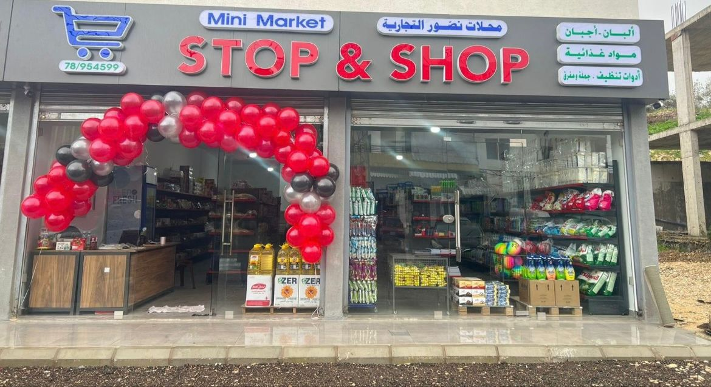

<!DOCTYPE html>
<html lang="ar">
<head>
    <meta charset="UTF-8">
    <meta name="viewport" content="width=device-width, initial-scale=1.0">
    <title>Stop & Shop</title>
    
</head>
<body>
<header>
    <h1>Stop & Shop</h1>
    
حاروف-حي البيدر -الشارع العام

    
⏰ ساعات العمل: 8:00 صباحًا - 10:00 مساءً

    
مفتوح

    

</header>

    <h2>مرحبًا بكم في Stop & Shop</h2>
    

        
        
تاريخ افتتاح السوبر ماركت: 1 يناير 2024

    

    

        <a href="(stp).html">تسجيل دخول الموظفين</a>
        <a href="(stp1).html">تسجيل دخول الزبائن</a>
        <a href="special-offers.html">العروض الخاصة</a>
    

   
    

        <a href="https://chat.whatsapp.com/HuYvdmUf6SpHCzGYK6zkhg" class="whatsapp">WhatsApp</a>
        <a href="https://www.facebook.com/share/SmxyVzbwcnpCYz8x/?mibextid=qi2Omg" class="facebook">Facebook</a>
        <a href="https://www.tiktok.com/@stopandshop75?_t=8o2On8R300z&_r=1" class="tiktok">TikTok</a>
    

<footer>
    
📍 Harouf, Al baydar, Main Street

</footer>

</body>
</html>

